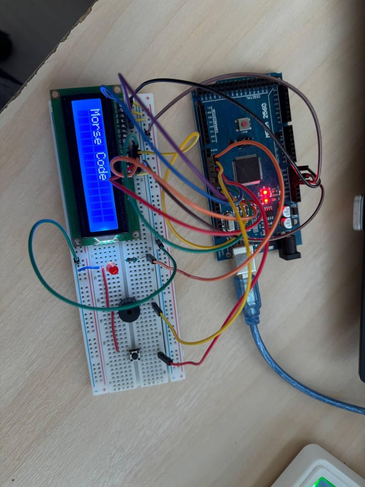
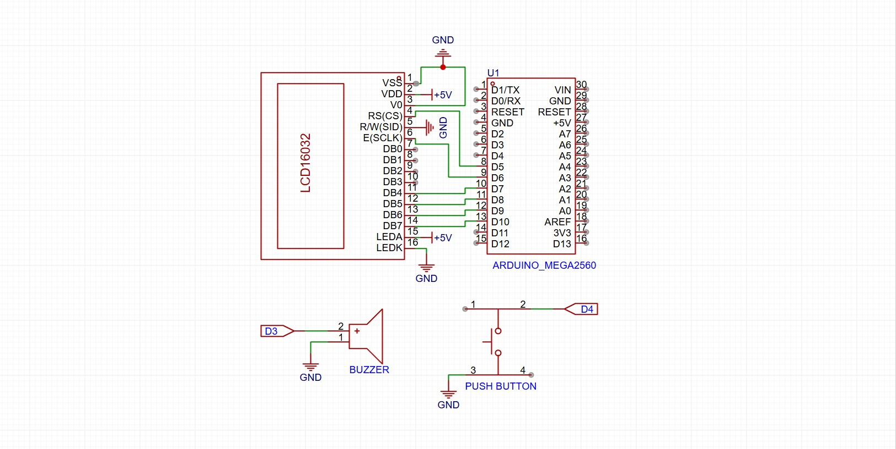

# Arduino Morse Code Translator with LCD

## 📌 Overview
This project implements a **Morse code translator** using **Arduino UNO** and a **16x2 LCD (HD44780)**.
User input is provided via a push button. Based on the input timing (short press / long press),
the system detects Morse code symbols (dot and dash), displays them on the LCD, convert it to English
characters and provides feedback using an LED and a buzzer.

The project focuses on fundamental **embedded system concepts** such as
digital I/O, timing-based logic, LCD interfacing, and hardware–software integration.

---

## 🎯 Objectives
- Get used to working with Adruino environment
- Practice interfacing a 16x2 LCD in **4-bit mode**
- Implement timing-based input detection (dot / dash)
- Use push button input with **internal pull-up resistor**
- Combine visual (LCD, LED) and audio (buzzer) feedback
- Organize an embedded project for a professional GitHub repository

---

## 🛠 Hardware Components
- Arduino UNO
- LCD 16x2 (HD44780 compatible)
- Push button
- LED + 220Ω resistor
- Active buzzer
- Breadboard & jumper wires

---

## 🔌 Pinout (Arduino ↔ LCD)

| LCD Pin |     Function    | Arduino Pin |
|---------|-----------------|-------------|
|   VSS   |     Ground      |     GND     |
|   VDD   |     Power       |     5V      |
|   VO    |     Contrast    |     GND     |
|   RS    | Register Select |     D5      |
|   RW    |   Read / Write  |     GND     |
|   E     |     Enable      |     D6      |
|   D4    |     Data        |     D7      |
|   D5    |     Data        |     D8      | 
|   D6    |     Data        |     D9      |
|   D7    |     Data        |     D10     |
|   A     |     Backlight   |     5V      |
|   K     |     Backlight   |     GND     |

### Other Connections

| Component | Arduino Pin |       Notes       |
|-----------|-------------|-------------------|
|  Button   |     D4      |    INPUT_PULLUP   |
|  LED      |     D2      | Via 220Ω resistor |
|  Buzzer   |     D3      |   Active buzzer   |

---

## 📐 Wiring Diagram


> The wiring was created using real hardware components

---

## 🧩 Schematic


> The schematic illustrates the logical connections between Arduino, LCD, and peripherals.

---

## ▶ Demo


---

## Morse Detection Logic

- Short press  (< 200 ms) → dot (.)
- Long press   (> 200 ms && < 900 ms) → dash (-)
- Pause (> 1000 ms) → character

---

### Run (PlatformIO)

1. Open this folder in VS Code.
2. Select the correct environment & board in `platformio.ini`.
3. Build/Upload/Monitor using PlatformIO toolbar, or terminal:
```bash
pio run
pio run -t upload
pio device monitor -b 9600
```
---

## 🧠 Implementation Notes
- The LCD operates in **4-bit mode** to reduce GPIO usage
- The LCD RW pin is tied to **GND** (write-only mode)
- The push button uses Arduino’s **internal pull-up resistor**
- Morse code detection is based on input press duration
- An **active buzzer** is used for audio feedback

---

## 📚 What I Learned
- Interfacing a 16x2 LCD using the HD44780 protocol
- Designing and documenting pinout, wiring, and schematic
- Handling button input using pull-up configuration
- Implementing timing-based logic in an embedded system
- Structuring a clean and professional GitHub repository for embedded projects

---

## 👤 Author
Hoang Bui - 2nd year Embedded Student

---

## 📄 License
This project is for educational purposes only.